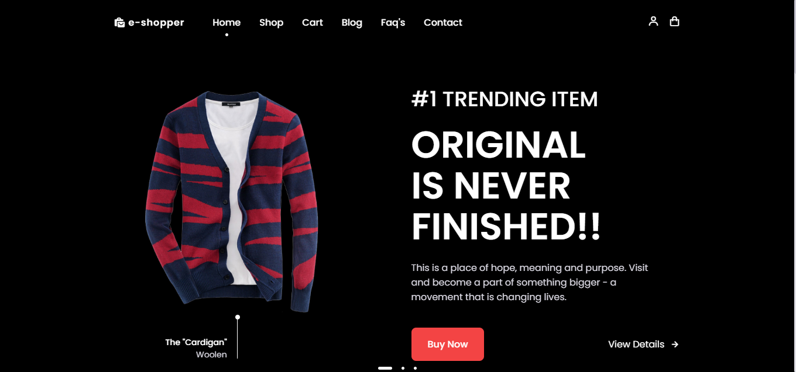

# Static E-commerce Website

This is a static e-commerce website built with HTML, CSS, JavaScript, and jQuery. 

## Features

- **Product Catalog**: Display a range of products with images, descriptions, and prices.
- **Responsive Design**: Optimized for mobile and desktop screens.
- **Interactive Elements**: Includes JavaScript and jQuery for enhanced user interactions.

## Technologies Used

- **HTML**: Structure of the website.
- **CSS**: Styling and layout.
- **JavaScript & jQuery**: Interactive elements and UI enhancements.

